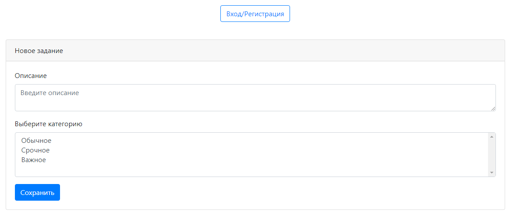

# Todo List

В приложении единственная html-страница (index.html), на которой отображается поле для добавления в таблицу задания с описанием. 
При введении текста в поле и нажатии на кнопку "Сохранить" задание попадает в таблицу в нижней части страницы.

В таблице по умолчанию отображаются только невыполненные задания.

При активной галке "Показать все" отображаются как невыполненные, так и выполненные задания.

В таблице каждое задание можно отметить выполненным (или невыполненным).

Если задание отмечено выполненным, оно перестает отображаться в списке (при неактивной галке "Показать все").

