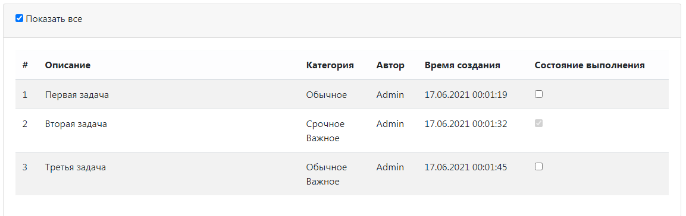

# Todo List

В приложении доступна регистрация и вход пользователей.

В приложении единственная html-страница (index.html), на которой отображается поле для добавления в таблицу задания с описанием, а также выбор категории задания (возможен выбор более одной категории). 
При введении текста в поле, выбора категории и нажатии на кнопку "Сохранить" задание попадает в таблицу в нижней части страницы.

В таблице отображается id, описание, категория, автор, время и дата создания задания, а так же выполнено оно или нет. 

В таблице по умолчанию отображаются только невыполненные задания.

При активном чекбоксе "Показать все" отображаются как выполненные, так и невыполненные задания.

В таблице каждое задание можно отметить выполненным.

Если задание отмечено выполненным, оно перестает отображаться в списке (при неактивном чекбоксе "Показать все").

